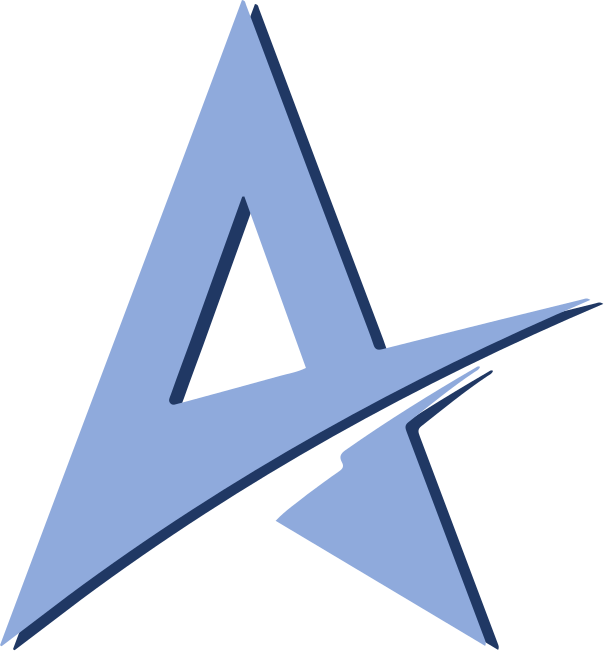
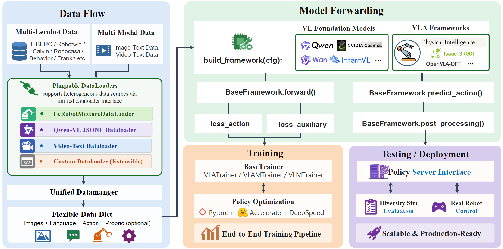

<p align="center">

</p>
<h1 align="center">StarVLA: A Lego-like Codebase for Vision-Language-Action Model Developing</h1>

<p align="center">An open-source research platform for integrating and exploring cutting-edge technologies for generalist robots.</p>

<p align="center">
<a href="https://starvla.github.io/"></a>
<a href="https://huggingface.co/StarVLA"></a>
<a href="https://arxiv.org/abs/2604.05014"></a>
<a href="https://github.com/starVLA/starVLA/issues/64#issuecomment-3715403845"></a>
</p>


---

In StarVLA (also a pun on "start VLA" ),  each functional component (model, data, trainer, config, evaluation, etc.) follows a top-down, intuitive separation and high-cohesion, low-coupling principle, enabling plug-and-play design, rapid prototyping, and independent debugging.

## News

> **⚠️ Branch notice:** The `starVLA_dev` branch is where we actively merge new features and may be temporarily unstable. For verified results, use the stable `starVLA` branch. We encourage trying `starVLA_dev` and welcome PRs if you spot any issues!


**[2026/04/09]** 🔜 🚀 unified **multi-benchmark co-training** example (combining LIBERO, SimplerEnv, RoboTwin, VLA-Arena, etc.) is coming soon. Stay tuned!

**[2026/04/09]** 🎯 Thanks to the [RLinf](https://rlinf.readthedocs.io) team, StarVLA now supports **RL post-training**! Check out the [StarVLA × RLinf tutorial](https://rlinf.readthedocs.io/en/latest/rst_source/examples/embodied/starvla.html) to get started.

**[2026/04/09]** 🔥 **WM4A (World Model for Action)** is now integrated! Use pretrained video-generation DiT models (Cosmos-Predict2, Wan2.2) as backbones for action prediction. See [docs/WM4A.md](docs/WM4A.md) for architecture details and training instructions.


**[2026/03/29]** 🔥 Thanks to the [ABot-M0](https://github.com/amap-cvlab/ABot-Manipulation) team for providing the [pre-trained weights](https://www.modelscope.cn/models/amap_cvlab/ABot-M0-Pretrain). For `Qwen3-VL 4B`, you can reload the `qwen_vl_interface` module in various frameworks!

**[2026/03/19]** 🔥 StarVLA now provides a complete real-robot development case with [Franka robot examples](https://github.com/starVLA/starVLA/pull/198)!

**[2026/03/03]** 🔥 We now support [**Qwen3.5** as a backbone for VLA](https://github.com/starVLA/starVLA/pull/172) — the fastest integration in the community ⚡
With more model size options: **0.8B, 2B, 4B, and 9B**! Build your VLA flexibly on top of native multimodal models!

**[2026/01/29]** 🔥 StarVLA [Training Efficiency Report](https://github.com/starVLA/starVLA/issues/158) & [Training Curves](https://github.com/starVLA/starVLA/issues/68) released!
Training configs and efficiency benchmarks for community reference.

**[2026/01/29]** Calvin benchmark experiments were conducted by the UNT team. For inquiries, please contact Zhijie Song (1600013008@pku.edu.cn) or Feng Yan (bphengyan@163.com).

**[2025/12/25]** We've simultaneously established pipelines for [Behavior-1K](examples/Behavior), [RoboTwin 2.0](examples/Robotwin), and CALVIN. We'd love to collaborate and share baseline results for more benchmarks with the community!

<details>
<summary><b>Prior Timeline</b></summary>

**[2025/12/25]**  We've released RoboCasa evaluation support, which was trained **without pretraining and reached SOTA performance**. Check out more details in [examples/Robocasa_tabletop](examples/Robocasa_tabletop).

**[2025/12/15]** Completed a release regression check to ensure the public code runs smoothly. Routine updates—including recent support for the LeRobot dataset v3.0 and DeepSpeed ZeRO-3—will continue to appear in the [🚧 Daily Development Log](https://github.com/starVLA/starVLA/issues/64#issue-3727060165).

**[2025/12/09]** Became the first open-source repository to support training with [train your vlm](starVLA/training/train_starvlm.py), [train your vla](starVLA/training/train_starvla.py), and [train your vla with vlm](starVLA/training/train_starvla_cotrain.py). Check out how to co-train your VLA with multimodal data in [examples/CoTrainVLM](examples/CoTrainVLM/README.md).

**[2025/11/12]** We now support [Florence-2](https://github.com/anyantudre/Florence-2-Vision-Language-Model) as a smaller VLM for resource-constrained development. StarVLA can now run on a single A100 GPU. See the [🚀Train with a smaller VLM](docs/faq.md#how-to-train-with-a-smaller-vlm) section for more details.

**[2025/10/30]:** We released the LIBERO Training & Evaluation README. Results are very promising. More details are in [examples/LIBERO](examples/LIBERO).

**[2025/10/25]:** We fixed several script links and so everything is smoother now. Thanks to the community for the feedback.

</details>

## Overview and Key Features


*Overview of the StarVLA framework. We present a unified and modular pipeline that connects heterogeneous data sources, pluggable dataloaders, and flexible data representations with a standardized model forwarding interface. The framework supports diverse vision-language foundation models and VLA architectures, enabling end-to-end training and deployment.*

<details open>
<summary><b>Various VLA Frameworks</b></summary>

All variants share the same data interface and infrastructure; only the action head differs.

- [x] **StarVLA-FAST**: Autoregressive discrete action tokens via a fast tokenizer (à la π₀-fast).
- [x] **StarVLA-OFT**: Parallel continuous action decoding with an MLP head (à la OpenVLA-OFT/EO).
- [x] **StarVLA-PI**: Flow-Matching action expert for diffusion-based continuous actions (à la π₀).
- [x] **StarVLA-GR00T**: Dual-system architecture — VLM as System 2, Flow-Matching as System 1 (à la GR00T).

<p align="center">

</p>

</details>

<details open>
<summary><b>Various Training Recipes</b></summary>

Every recipe is paradigm-agnostic and applies uniformly to all supported frameworks.

- [x] Supervised fine-tuning (SFT)
- [x] Multimodal Multi-objectives Co-Training
- [x] Cross-embodiment Co-Training
- [ ] Reinforcement Learning Adaptation

</details>

<details open>
<summary><b>Broad Benchmark Integration</b></summary>

Achieve **state-of-the-art (SOTA) performance** on a variety of benchmarks, as follows:

- [x] **SimplerEnV**
- [x] **LIBERO**
- [x] **LIBERO-plus**
- [x] **Robocasa**
- [x] **RoboTwin**
- [x] **BEHAVIOR**
- [ ] **SO101**
- [x] **Calvin** *See details in [`examples/calvin`](examples/calvin)
- [ ] **RLBench**

</details>

## Installation

```bash
# Clone the repo
git clone https://github.com/starVLA/starVLA

# Create conda environment
conda create -n starVLA python=3.10 -y
conda activate starVLA

# Install requirements
pip install -r requirements.txt

# Install FlashAttention2
pip install flash-attn --no-build-isolation

# Install StarVLA
pip install -e .
```

<details>
<summary><b>⚠️ Common Issues</b></summary>

flash-attn can be tricky to install because it must match your system's CUDA toolkit (nvcc) and PyTorch versions. The `--no-build-isolation` flag resolves most issues, but on newer systems you may need to manually choose a compatible flash-attn version. Ensure your CUDA driver/toolkit and torch versions are aligned. Check your environment:

```bash
nvcc -V
pip list | grep -E 'torch|transformers|flash-attn'
```

If issues persist, pick a flash-attn release that matches your versions (CUDA and torch) or ask ChatGPT with its search function for help with the outputs above.

We have verified that `flash-attn==2.7.4.post1` works well with nvcc versions `12.0` and `12.4`.

</details>

---

## Quick Start

<details>
<summary><b>1. Quick Check StarVLA</b></summary>

```bash
python starVLA/model/framework/QwenGR00T.py
```

You should download [Qwen3-VL-4B-Instruct](https://huggingface.co/Qwen/Qwen3-VL-4B-Instruct) and put it as `./playground/Pretrained_models/Qwen3-VL-4B-Instruct`. It should build successfully and `print(model)`. You can also call `model.forward(fake_data)` and obtain unnormalized actions via `model.predict_action(fake_data)`.

</details>

<details>
<summary><b>2. Evaluate Existing Models</b></summary>

We publish benchmark-specific evaluation guides inside each folder under [examples](examples).

**Recommended quick start: LIBERO simulator**

1. Download [Qwen2.5-VL-GR00T-LIBERO-4in1](https://huggingface.co/StarVLA/Qwen2.5-VL-GR00T-LIBERO-4in1).
2. Follow the [LIBERO Eval](https://github.com/starVLA/starVLA/tree/starVLA/examples/LIBERO#-1-environment-setup) instructions to prepare the Python environment.
3. Set the environment variables at the top of [`eval_libero.sh`](examples/LIBERO/eval_files/eval_libero.sh) and [`run_policy_server.sh`](examples/LIBERO/eval_files/run_policy_server.sh).
4. Run:

```bash
bash examples/LIBERO/eval_files/run_policy_server.sh &
bash examples/LIBERO/eval_files/eval_libero.sh
```

⚠️ **Common issue**
If `NotImplementedError: Framework QwenGR00T is not implemented` appears, run `python starVLA/model/framework/QwenGR00T.py` to verify your environment.

</details>

<details open>
<summary><b>3. Train Your Own Model</b></summary>

We ship benchmark-specific training scripts under [examples](examples). We recommend starting with the  [LIBERO suite](examples/LIBERO/train_files):

1. Edit `run_libero_train.sh` to point to your checkpoint, dataset root, and desired output directory.
2. Launch training:

```bash
bash examples/LIBERO/train_files/run_libero_train.sh
```

⚠️ **Note:** Ensure all absolute paths inside `run_libero_train.sh` match your local environment before launching.

</details>

---

## Benchmark Results

<details open>
<summary><b>Results on LIBERO</b></summary>

<p align="center">

</p>

</details>

<details open>
<summary><b>Results on SimplerEnv</b></summary>

<p align="center">

</p>

</details>

<details>
<summary><b>Results on RoboCasa GR1</b></summary>

<p align="center">

</p>

</details>

<details>
<summary><b>Results on Calvin_D_D</b></summary>

<p align="center">

</p>

</details>

We have more results for RoboCasa, RoboTwin 2.0, Behavior-1k, Calvin. See our [🍀 Overleaf](https://www.overleaf.com/read/qqtwrnprctkf#d5bdce), which continuously presents our real-time experimental results.

---

## Model Zoo

See the full list of released models and checkpoints in [docs/model_zoo.md](docs/model_zoo.md).

---

## Start Building Your VLA Like Lego!
👇 StarVLA achieves "Lego-like" development via the following designs:
<details>
<summary><b>1. Smoke test any submodule</b></summary>

StarVLA emphasizes a modular model design. Each major framework file can be run standalone for rapid debugging and smoke-testing your code. For example:

```bash
# model
python starVLA/model/framework/QwenOFT.py --config_yaml starvla_cotrain_oxe.yaml
# dataloader
python starVLA/dataloader/lerobot_datasets.py --config_yaml starvla_cotrain_oxe.yaml
```

Note: `starVLA/model/framework/yourframework.py` is the single external API surface of the model; it should mirror (be structurally isomorphic to) the framework diagram in your paper.

</details>

<details>
<summary><b>2. Explicit model boundaries</b></summary>

StarVLA follows top‑down decomposition and the principle of high cohesion & low coupling.

For example:
- Dataloader
  - Returns a raw, model‑agnostic dict only; no model‑specific preprocessing (e.g., tokenizer, image encoding).
  - A single sample should include (add/remove as needed):
    - image: list[PIL.Image] | np.ndarray
    - lang: str
    - action: np.ndarray[T, action_dim]
    - state: Optional[np.ndarray[..., state_dim]]

Both `framework.forward()` and `framework.predict_action()` operate directly on raw inputs, keeping train/test boundaries explicit and easy to hack.

</details>

<details>
<summary><b>3. Flexible configuration system</b></summary>

StarVLA uses a single global configuration object
Parameters are passed primarily via extensible dicts, allowing overrides and controlled redundancy.

</details>


<!-- 🧪 *To self‑test and iterate on StarVLA's usability, we re‑implemented several representative VLA frameworks. We have done a beta test: an internal developer can stand up a new VLA framework in under half a day (less than 3 hours), and a new user can build their first custom VLA framework within a single day. More design insights for each item can be found in *[*assets/intro_v1.md*](assets/intro_v1.md)*.* -->

---

## FAQ

See [docs/faq.md](docs/faq.md) for common questions on configuration, freezing, learning rates, checkpointing, smaller VLMs, and more.

## Contributing

Community contributors are the driving force behind StarVLA's growing ecosystem. We deeply appreciate every PR, bug fix, and piece of feedback from the open-source community — your efforts keep StarVLA evolving rapidly. A full, continuously updated contributor list is maintained at [starvla.github.io/contributors](https://starvla.github.io/contributors).

Thanks to all the people who have contributed to StarVLA:

<a href="https://github.com/starVLA/starVLA/graphs/contributors">

</a>

See [docs/CONTRIBUTING.md](docs/CONTRIBUTING.md) for guidelines on reporting bugs, proposing features, and submitting PRs.

### Projects Based on StarVLA

**NeuroVLA**: [*A Brain-like Embodied Intelligence for Fluid and Fast Reflexive Robotics Control*](https://github.com/guoweiyu/NeuroVLA)

**PhysBrain**: [*Human Egocentric Data as a Bridge from Vision Language Models to Physical Intelligence*](https://zgc-embodyai.github.io/PhysBrain)

**TwinBrainVLA**: [*TwinBrainVLA: Unleashing the Potential of Generalist VLMs for Embodied Tasks via Asymmetric Mixture-of-Transformers*](https://github.com/ZGC-EmbodyAI/TwinBrainVLA)

**LangForce**: [*LangForce: Bayesian Decomposition of Vision Language Action Models via Latent Action Queries*](https://github.com/ZGC-EmbodyAI/LangForce)

Examples:
```bash
accelerate launch \
  --config_file starVLA/config/deepseeds/deepspeed_zero2.yaml  \
  --num_processes 8 \
  starVLA/training/train_internvla.py \
  --config_yaml ./starVLA/config/training/starvla_cotrain_oxe.yaml \
  --framework.qwenvl.base_vlm Qwen/Qwen2.5-VL-7B-Instruct \ # override framework choice
  --framework.qwenvl.base_vlm Qwen/Qwen2.5-VL-7B-Instruct \ # override framework choice
  --framework.action_model.new_module ${module_name} \ # plug-in a new module to action model
```

⚠️: `framework.action_model.new_module` only adds to the global config; its behavior is on your framework.


</details>

<details close>
<summary><b>Q: Can I freeze the VLM via parameters?</b></summary>

A: Yes. StarVLA uses a regex / name list to control freezing. Example:
```
--trainer.freeze_modules "qwen_vl_interface.model.model.visual,dino_encoder" \
```
Tips: You can ``print(your_model)`` first to check the relative paths of your modules and list them as comma-separated values.
(implementation in `TrainerUtils.freeze_backbones`.)

</details>

<details close>
<summary><b>Q: Can I set different learning rates for different modules?</b></summary>

A: Yes, starVLA also uses name: value dict to control learning group. Config example:
```yaml
trainer:
  learning_rate:
    base: 1e-05      # other modules
    qwen_vl_interface: 1.0e-05
    action_model: 1.0e-04
```
(Also referenced in `trainer_tools.build_param_lr_groups`.)
</details>

<details close>
<summary><b>Q: Can I resume training from a checkpoint?</b></summary>

A: Yes, somehow can. Specify the latest checkpoint path in `config.yaml`, e.g.:
```yaml
trainer:
  pretrained_checkpoint: path_to_steps_10000.pt
  reload_modules: "action_model"
```
Empty `reload_modules` means full load all model. However, starVLA does not save  `optimizer state`. It requires a lot of  memory/disk and bring limited benefit.
</details>


<details id="train-smaller-vlm" close>
<summary><b>🚀 Train with a smaller VLM</b></summary>

```bash
    accelerate launch \
      --config_file starVLA/config/deepseeds/deepspeed_zero2.yaml \
      --main_process_ip $MASTER_ADDR \
      --main_process_port $MASTER_PORT \
      --machine_rank $SLURM_PROCID \
      --num_machines $SLURM_NNODES \
      --num_processes=${TOTAL_GPUS} \
      starVLA/training/train_starvla.py \
      --config_yaml ./starVLA/config/training/starvla_cotrain_oxe.yaml \
      --framework.name QwenGR00T \
      --framework.qwenvl.base_vlm microsoft/Florence-2-large \
      --run_root_dir ${run_root_dir} \
      --run_id ${run_id} \
      --wandb_project your_project \
      --wandb_entity your_name
```

Note: To ensure better compatibility with already released checkpoints, we are continuing to use `--framework.qwenvl`. This parameter will be unified in the next release.

</details>


## ✍️ Citation & Copyright

## Citation & Copyright

StarVLA is released under the MIT License, which permits commercial use, modification, distribution, and private use. Rebases are allowed for forks and feature branches; when rebasing from upstream StarVLA, use descriptive commit messages (e.g., "chore: rebase from StarVLA") and keep at least the two latest upstream commits as separate. See [License](LICENSE) for details.

```
@article{starvla2025,
  title={StarVLA: A Lego-like Codebase for Vision-Language-Action Model Developing},
  author={StarVLA Community},
  journal={arXiv preprint arXiv:2604.05014},
  year={2026}
}
```

## Acknowledgements
This project draws inspiration and references from several notable open-source initiatives, including:
- [LeRobot](https://github.com/huggingface/lerobot)
- [GR00T](https://github.com/NVIDIA/Isaac-GR00T/tree/main)
- [DeepSpeed](https://github.com/deepspeedai/DeepSpeed)
- [Qwen-VL](https://github.com/QwenLM/Qwen3-VL/tree/main)
- [InternVL](https://github.com/OpenGVLab/InternVL)
- [ABot-Manipulation](https://github.com/amap-cvlab/ABot-Manipulation)

The codebase was originally forked from [InternVLA-M1](https://github.com/InternRobotics/InternVLA-M1).

## Star History
Here's how our community has grown over time:

[](https://www.star-history.com/#starVLA/starVLA&type=date&legend=bottom-right)


<!-- *Chart updates automatically. Click to interact with the full timeline.* -->
